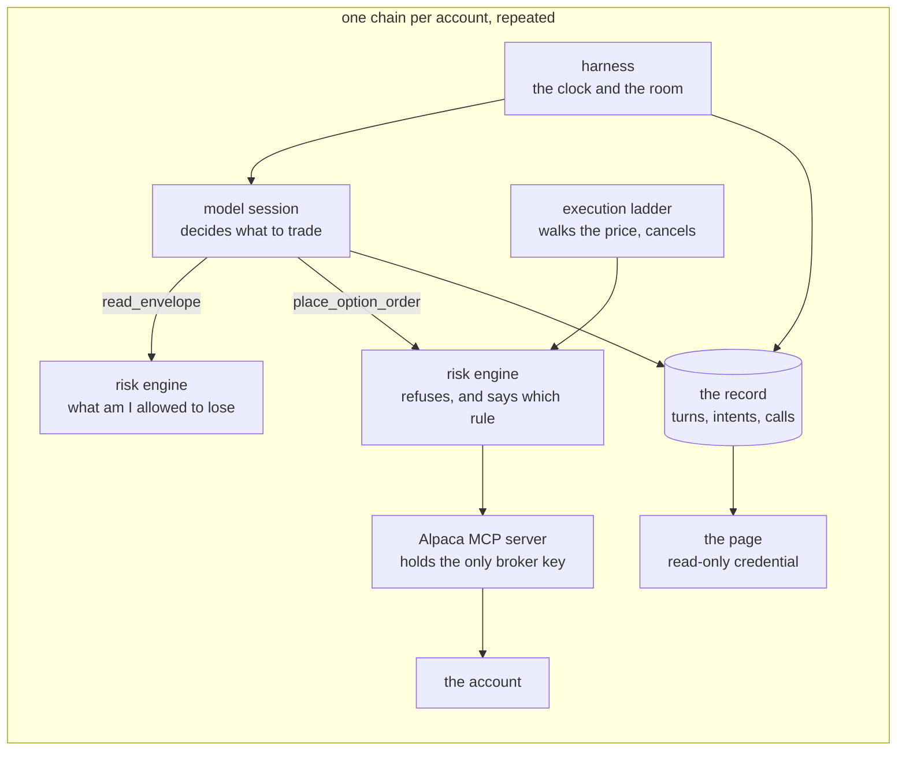

# Architecture

Two networks, one binary with four roles, and one chain repeated per account. The shape exists to make one property true: **the agent reaches nothing except the services beside it and the hosts the proxy allows.**

**One name, and what it is called in the code.** The service every order passes
through is the RISK ENGINE throughout these documents. In the source and in the
configuration it carries its older name: the package that stands in for its
disclosure side is `golang/internal/envelope`, the tool a session calls is
`read_envelope`, and the address is `BROKER_MCP_URL`. Same thing, two vocabularies -
this one because a reader who trades knows what a risk engine is, that one because
renaming an identifier a running deployment resolves is not a thing to do on a
deadline.

## How to check every claim in this document

The system has two halves and each is verified its own way. The trading engine is
settled by reading it and running its tests. The risk engine is settled by what it
did: the record of every call it answered, every refusal among them with the rule
that made it, and the limits it hands out, live at `GET /api/limits`.

**Settled by reading this repository, and by tests that go red without the rule:**

| Claim | Where |
|---|---|
| The agent holds no broker key: a gateway address and a token, and nothing else | `golang/internal/config`, `envexample_test.go` |
| The one order the machinery places itself can only reduce the book | `marketdata.CloseStructure`, `TestEveryLegOfAClosingOrderSaysItCloses` |
| The ladder cancels an order too large for one position, and one whose loss has no floor | `execution.WorstCase`, `execution.Unbounded`, `toobig_test.go` |
| A concession that breaks the rule the entry was made on is refused | `TestAWorstPriceBelowTheEntryRuleIsNotWalkedTo` |
| The session is told its limits at runtime, and which limits depend on the token it was started with | `golang/internal/envelope`, `envelope_test.go` |
| Every published number that can be recomputed, recomputes | `make claims` |

**Settled only against a running deployment:**

| Claim | How |
|---|---|
| An order the gateway refuses never reaches Alpaca, and the refusal names the rule | the refusals in `tool_calls`, shown on the page beside the call that was refused |
| A limit tightened while the agent runs reaches the next turn | change it and watch `GET /api/limits` and the next intent |
| The whole read path holds under four callers at once | `make rehearse`, which prints what was refused |
| The account traded the way these documents describe | `make account-claims PAGE=...`, which reads the page and needs nothing of ours |

The risk engine is a service with an API, and that is what makes the second table
possible: it stands on the path every order takes, it is the only thing that can
refuse one, and it writes down what it refused and which rule refused it. Its rules
are declarations rather than code, each carrying how much of itself it tells the
agent - a boundary with its number, or the bare fact that a rule exists - so a
session can plan inside a limit without being handed a map of how to route around
it. An operator changes one while the agent is running and the next turn sees it.

Two ways to check its work from outside it: the refusals it wrote are in
`tool_calls` and on the page, beside the call each one stopped; and the broker's own
order list, which `make reconcile` reads, says independently which orders ever
reached Alpaca.

## One agent is one chain

Every link belongs to exactly one account and carries that account's name:



```
alpaca-agent-1      ->  gateway endpoint alpaca-agent-1      ->  alpaca-mcp-agent-1      ->  account 1
alpaca-agent-2      ->  gateway endpoint alpaca-agent-2      ->  alpaca-mcp-agent-2      ->  account 2
alpaca-agent-stand  ->  gateway endpoint alpaca-agent-stand  ->  alpaca-mcp-agent-stand  ->  the submitted account
```

**The account submitted for judging is the third chain**, `alpaca-agent-stand`,
Alpaca paper account `PA3BXFR0ZVYC`. It is the only account this repository names,
and it is the one the page at the top of the README serves: open the page, open the
account, and they are the same book. Its
harness runs on the server that also serves the page, and its declaration is
`agent/alpaca-agent-tikhon.yaml` - one declaration, two accounts, which is what the
declaration's own header means by "two accounts run the same playbook on purpose,
and the difference between them is the whole experiment". The other account on that
declaration was started before the kickoff for testing and is not submitted.

Its page keeps no database, deliberately: that agent's record lives where the agent
runs, and a page pointed at the wrong database showed another account's equity line
once already. So the judged page serves what the broker answers - the account, the
positions and every order with its legs - and `make account-claims PAGE=...` checks
exactly that.

One harness, one endpoint at the gateway, one Alpaca MCP server, one account, one database, one page, one credential, one risk-engine identity. Adding an account means adding a chain rather than a setting.

Two things stand outside the chain and are shared on purpose: the Postgres server, which gives each agent a database of its own, and the `envelope` service, which holds no credential and answers each caller only what that caller's identity is granted.

The reason is not symmetry. Alpaca's server reads its keys from its own environment, so a process serves exactly one account and no request can name another; the gateway applies limits to whoever asked, so two agents behind one credential would be one agent to the rules; and a shared database would let one agent's restart close the other's open turns. The name is the same at every link so that a row in the record, a refusal at the gateway and a container in `docker ps` can be read as the same agent without a table.

Every call it makes to the broker goes through the risk engine, at `BROKER_MCP_URL`, carrying the agent's own credential. The gateway is what decides whether a tool may be called at all, and by which agent. An order the gateway refuses never reaches Alpaca, and the refusal says which rule refused it.

What holds that route in place is the agent's configuration and its credential, not the network: on this stack the agent and Alpaca's own MCP server share the `internal` network, so a session that decided to address that server directly could. The separation is one network apart - the broker's server on a network the agent is not on - and it is not made here, because this stack is a demonstration and the account it trades is paper. Anywhere real money moved, that separation would come first.

The credential is per agent, so the record names WHICH agent made each call, and one agent can be stopped without touching the other. The surface that displays the account carries a different one, which can read and cannot order: a page that could trade is a page whose leak is a trade.

Its calls to the model go the same way, at `MODEL_GATEWAY_URL`, under a path that names the agent. The session keeps using its own subscription login - the gateway forwards it upstream unchanged and stores nothing - so what each agent asked the model is recorded without anyone handing over a credential. Its outbound requests go through the gateway too, which allows the hosts it is configured with and refuses the rest.

That is true of a stack whose gateway sits on the same machine. A stack run elsewhere reaches the gateway over the internet for the BROKER only: the model and internet gateways are not published, because neither can require a credential yet. So "everything through the gateway" describes this deployment, and a second deployment records its broker calls and nothing else.

Its limits come from outside it too. The session asks `read_envelope` before it builds anything and is told what applies to it and by which version of the rules; no number it sizes with is written anywhere in its prompt. That answer comes from the risk engine's disclosure side beside it, under the same server name - so a limit is **disclosed** there and **enforced** on the order path, and neither is anything the session can talk its way out of.

## Services

| Service | What it is | Where it can go |
|---|---|---|
| `alpaca-agent-1`, `alpaca-agent-2` | our binary holding the clock, the volatility history and the session's tools, and the agent it starts | the broker's server, the risk engine, Postgres, and the egress proxy |
| `envelope` | the same binary answering what one caller may do on one tool, from `policy/envelope.yaml` | nowhere: it reads a file |
| `page-agent-1`, `page-agent-2` | the same binary serving the read side and the built page | Postgres, and the broker for the money it shows |
| `migrate` | applies `postgres/migrations` in name order, then exits | Postgres |
| `alpaca-mcp-agent-1`, `alpaca-mcp-agent-2` | Alpaca's own MCP server (`alpaca-mcp-server`, pinned release), one process per account because it reads its keys from its own environment | Alpaca |
| `egress` | the agent's only way out: a forward proxy that answers for the hosts in its allowlist and refuses and logs the rest | the hosts it allows |
| `postgres` | state | nowhere |

The risk engine is a service of its own, addressed by `GATEWAY_URL` the same way Alpaca and the model provider are - which is what lets one engine hold the rules for several agents at once and lets an operator change a ceiling without touching any of them.

`envelope` stands in that address until the gateway does. It answers the risk engine and nothing else: it holds no broker credential, reaches nothing, and cannot judge or refuse an order - those are the gateway's, and a stand-in that grew them would be a second engine nobody agreed to run. Which limits a caller gets is decided by the bearer token it was started with, so the two agents on the stack are under different ceilings and neither can ask for the other's.

The file it reads is mounted from the checkout rather than baked into the image, because lowering a ceiling has to be one edit that a running session sees on its next question. A limit that needs a restart to change is a limit nobody can be shown changing.

## Networks

`internal` has no route out, and a port published on it is never bound. `outbound` is ordinary bridged networking.

The agent sits on `internal` alone. Everything it can do is therefore enumerable: call the services beside it, or ask the proxy, which answers only for the hosts in its allowlist and logs every refusal. Widening that list is a change to this repository, not a decision the session can make.

Each `alpaca-mcp-agent-*` also sits on `outbound`, because it talks to Alpaca. So does each page: a browser has to reach it, and a port cannot be published on `internal`.

## The four roles

`ROLES` selects them. `harness` and `mcp` run together in `agent`, because the session reaches its own toolbox over localhost. `api` runs alone in `page`: it reads the record out of Postgres, so it needs nothing the session holds. `envelope` runs alone too, and holds no credential at all.

- **`harness`** decides *when* a session runs and says *why* it woke it. It never decides what to trade - the session does, and the autonomy requirement rests on that line. Three causes wake a session: the schedule in the declaration, a person writing in the chat, and a wake-up the session asked for itself, by time or by price. With neither it refuses to start, because a harness that runs while waking nobody looks exactly like a working one.

  The harness runs the agent as a child process and reads its event stream: every message the session produces is posted to the chat, and each tool call replaces one status line rather than adding a message. A person writing back wakes the next session on the same thread, so the conversation continues rather than restarting. **The agent knows nothing about the chat** - that is what makes a session woken by the clock and one woken by a person the same thing from inside.
- **`api`** serves the read side: `/healthz`, `/api/state`, `/api/money`, `/api/equity` and the built page from `WEB_DIR`. Data sits under a prefix and the page at the root, so a file on the page can never quietly shadow a route of the same name. It decides nothing and orders nothing; it reads the record, and it asks the broker what the account is worth.
- **`mcp`** is the session's own toolbox (`internal/sessiontools`), carrying what Alpaca's cannot: `record_intent`, which a session calls *before* it orders anything; `read_state`, which the next session calls to learn what already happened; and `post_to_chat`, which tells the people watching. A judge can see fills anywhere; only the first of these says what the session meant to do.

  `post_to_chat` exists only when a chat is configured. An agent that can see a tool assumes it works, so an unconfigured channel offers no tool rather than one that fails. `read_candidates` follows the same rule: it appears only where a screener is running.
- **`envelope`** answers what one caller may do on one tool, from a file an operator edits. It is described above; it is a role rather than a separate program because the stand-in and the thing it stands in for must answer identically.

## What differs between the two chains

The same binary runs twice, under two sets of limits: `alpaca-agent-1` sells far from the price, `alpaca-agent-2` sells half as far. Only the declaration and the credentials differ - no code is branched, which is the point of putting the strategy in a declaration rather than in an interface.

The declaration says three things: when each session wakes and what it is asked to do, which skills the agent is given, and the numbers those skills are run with. It is re-read while the process runs, so tightening a window or adding a session is one edit rather than a restart in the middle of a trading day. The same tick also brings the skills the session reads level with what the source holds, so editing the text of a technique reaches a session already at work. A file that is half-saved or does not check out is refused and said so in the log; the schedule already in force keeps working.

## Checking it before the day rather than during it

Two things exist because a suite that passes proves the code agrees with itself
and nothing more.

`internal/structures` names every option structure a declaration can open - a
credit vertical, a backspread, a ratio - and what each guard does with each. The
guard that decides which structures the profit watch may close is tested against
all of them, so a new shape fails the build until somebody says what happens to
it. That decision is the one that goes missing: a guard written when only
verticals existed keeps running unchanged when the first backspread arrives, and
says nothing.

`apps/rehearse` sends the reads of a trading day - every agent at once, each down
its own entry point with its own credential, at the screener's own batch size -
and prints what came back, counted by reason. It writes nothing. Reads work with
the market closed, which is the point: the answer is available on a Sunday.

## The record

Eleven tables. Four carry what the agent did, and each answers its own question: `turns` - when a session ran and how it ended; `turn_causes` - what was put in front of that turn, in order; `tool_calls` - what it did with its hands, with the arguments it sent and what came back; `intents` - what it meant to do before it ordered anything. The harness writes all but the last from the agent's own stream, whether or not a chat is watching; `record_intent` writes that one.

`turn_causes` is a list rather than a column on `turns` because a turn is woken once and then told more things while it runs: an entry window opens one, and a defence window or a person says something into it minutes later. Each row's id is its order, since two causes that meet on the same minute carry the same timestamp. Every intent points at the cause that was in force when it was written, resolved inside the same transaction as the insert - so the record answers "what was this turn doing when it said that" from a row, not from a comparison of clocks.

`execution_steps` carries what happened to an order after the session let go of it: every price the ladder walked it to, the cancellation if the book never came, and the fill with its price and how many contracts. Without the count the record holds a price and not money - a fill at 0.28 says nothing about whether twenty-eight dollars was collected or fourteen hundred.

`said` carries the agent's own words, line by line against the turn that spoke them - the reasoning behind an entry, and behind a refusal. It is written by the harness from the same stream it posts to the chat, because the alternative was parsing codex transcripts on every page request: a second route to the data, in a format that is not ours. 469 lines on the first judged day.

`volatility_samples`, `account_snapshots` and `candidates` carry what the market and the account were worth over time, and what the screener last priced.

A refused order is in `tool_calls`, in the broker's own words. There is no separate table of refusals: the structured refusal is the gateway's, the gateway is a service outside this stack with no path into this database, and a table that can only be empty reads as "the agent was never stopped" rather than as "we do not know". It returns with the gateway that fills it.

It lives in Postgres because it is the evidence: a restart must not empty the page a judge is reading. `RECORD_SHOWS` bounds how many rows of each kind that page carries.

`record_account` holds one row: the name of the account this record is of. The agent writes it the first time it starts and every process compares its own name against it before serving anything, so a database reached by the wrong `DATABASE_URL` is a refusal at startup rather than one account's equity line shown under another's name.

## The volatility history

An entry rule that compares today's implied volatility with its own past needs a past, and the broker answers only for today. So the process holding the clock reads one contract per underlying every few minutes while the market is open - the at-the-money put about three weeks out - and writes it to `volatility_samples`. The session asks `read_volatility_history` where the latest reading sits in that series.

Three weeks out, and always a put, on purpose. The option this project trades expires the same day: its implied volatility swings with the hour, so a series built from it measures the clock. And a series that mixes calls with puts moves when the skew moves, saying nothing about the level.

Nothing here decides anything: the reading is mechanical, no session is woken for it, and what a rank of 80 means is the session's to say.

`VOLATILITY_UNDERLYINGS` and `VOLATILITY_EVERY` turn it on. The series is worth what its length is, so it starts on the first day of the event and is never paused.

## Finding what is worth deciding about

A session that hunts for itself gets through six underlyings before its turn runs out, and those six are whichever the schedule handed it - so an opportunity on the seventh is not rejected, it is never seen. On 26 August none of six passed, while a name outside them was paying a quarter of its risk.

What separates a structure that earns from one that loses is arithmetic over quotes. So `internal/screener` does it in code, over a few hundred underlyings, every few minutes, inside the broker's rate limit. The session asks `read_candidates` and chooses from a ranked shortlist.

It reads and cannot order: its interface to the broker has no method that changes anything. It also knows nothing about the account - what is held, what risk is already taken, whether to trade at all - and that is deliberate. The list is what the market offers, not what should be taken.

### One measure, not a row of thresholds

Everything that bears on the decision goes into the number the list is ranked by, and nothing sits beside it as a floor. `edge_points` is how many percentage points a structure pays above what it has to survive: the chance the sold strike is not crossed, less the share of the time the credit has to win to break even.

Both inputs are already inside it, which is why neither gets a threshold of its own. What the structure pays against what it risks IS the second term - the break-even share is `risk / (credit + risk)`. What the book charges to get in is taken out of the credit before anything is measured, and the result is reported as `credit_after_cost`, so a structure quoted wide shows a worse number rather than tripping a separate rule.

The reason is not tidiness. A threshold beside a measure is a second place holding the same knowledge, and it discards without ranking: it cannot say that the structure it rejected was the best on offer. Four such thresholds were removed on 26 August after each was measured - one discarded 833 structures in a single sweep against 96 for the next filter, another emptied the list entirely, a third rejected the best candidate of the day for missing its floor by seven tenths of a point.

Thresholds remain where they catch nonsense rather than choose between sound structures: a quote paying more than the width it risks, a crossing that eats the whole credit.

One more remains, and it bounds the INSTRUMENT rather than the opportunity. Edge is counted in points of the width, and credits move on a one-cent grid, so one tick of credit is `100 / width` points: two points on a half-dollar spread, a fifth of a point on a five-dollar one. The same threshold therefore means one and a half cents on one row and fifteen on another, and the ranking fills its top with the rows it can least measure - on 31 August every one of the 119 structures clearing +3 was a dollar wide or narrower, and the session's own re-quote turned them negative. `screener_least_width` refuses those, not because their edge is small but because it cannot be read. It is not the class of threshold removed above: those discarded structures whose value the measure already carried.

### What one sweep costs

The broker allows 180 requests a minute, and that limit - not the arithmetic - is the whole cost of a sweep. So the number of requests per underlying IS the reach of the screener.

It was two: list the contracts, then price them. `get_option_chain` brings both back in one call, with the implied volatility and the greeks alongside, and the sweep over 284 underlyings fell from 153 seconds to 86 while the structures it found rose from 9 to 18. Nothing about the arithmetic changed; the same limit simply reaches twice as far.

### What the sweep looks at

Every sold strike is priced against every protective strike behind it, out to five. Width is a dimension of the structure, not merely its size, and it is invisible to the ratio: where credits fall evenly across strikes, a spread four strikes wide collects four times the credit against four times the risk, which is the same ratio. What changes is the crossing - two legs cost two crossings whatever sits between them, so the same toll is charged against four times the credit. On live proportions the narrow structure gives up four fifths of its credit getting in where the wide one gives up a fifth.

### Where the chance of surviving comes from

The broker's delta is a reading of how likely the sold strike is to finish in the money, and it is used where it exists. On the day a contract expires it does not: measured on 26 August, of 28 QQQ contracts expiring that day none carried a delta - and none carried an implied volatility either.

Refusing that book would remove the structures that pay most on the day, so the volatility is borrowed from the nearest expiration of the same underlying that has one, and the chance is computed from it. `edge_from` says which of the two a number came from, and the distinction is load-bearing: volatility at the very short end usually sits above the days behind it, so a borrowed number understates how often the strike is reached and therefore overstates the edge. A rule reading a borrowed measure has to ask more of it, not less. An underlying quoted without volatility anywhere in the window is left unmeasured rather than given a number invented for it.

Two more filters exist because of what the first live sweeps produced, and each is a fact about data rather than a preference:

- **A structure paying more than it risks is a broken quote, not a gift.** The list is ranked by exactly the number bad data inflates, so without this the worst data arrives first.
- **Distance in percent is not likelihood.** One percent is far on a quiet index and near on a share that moves five percent in a day; ranked on distance alone the list was unusable by a rule written in deltas.

## Where a declared limit stops being advice

The risk engine tells a session what it may risk; the session works its own size out from that and can get it wrong. On 26 August one did: the broker refused 17 884 sets for want of buying power, and the session came back with 906 - a maximum loss near 76 000 against a limit of 15 000. Nothing between it and the market disagreed, because a service that discloses does not enforce.

The ladder is where our code last holds an order, so the limit is enforced there. It reads the same ruleset the risk engine serves and the same account the broker reports, works out the worst a resting order can do, and cancels what exceeds one position's allowance - telling the session what it actually risked. The ruleset is re-read every pass, so lowering a ceiling is one edit and no restart.

The worst case is exact rather than sampled: a spread's payoff is piecewise linear, so its minimum lies at a strike, at zero, or above the highest strike. The ratio comes off the legs themselves, or a backspread would be priced as a vertical and charged a loss it cannot have.

Three refusals are deliberate. An order this code cannot parse is left alone, because unknown is not the same as too large and cancelling a sound structure over our own parse failure is the worse error. An unreadable ruleset cancels nothing and says so: losing the limit is a reason to speak, never a reason to take an account's working orders away. And a cancelled order is not then walked toward a book it must never reach.

This is a backstop, not a gateway. It acts seconds after an order reaches the book rather than before it, and the difference matters for anything that could fill instantly.

## Getting a decided order filled

The session decides what to sell, how large, and the price it wants. Walking a limit a cent at a time until the book takes it is not that kind of decision: it is arithmetic on a clock, it has to happen in seconds, and one turn of the agent costs a minute and a half. So the two are split.

`internal/execution` walks an unfilled multi-leg order toward the price the book is actually showing - every leg it sells at the bid, every leg it buys at the ask - one tick at a time, and stops there. It never asks for a worse price than the book's own, and it cancels what the book has refused for `EXECUTION_PATIENCE`. It can move a price and cancel an order; it can open nothing.

It only ever concedes. A book standing better than the order's own limit does not move it: that order is either about to fill or resting on a quote nobody will trade, and asking for more credit answers neither. It also says a fill once - in the room as one line, in the record with its price and size - and tells the session when an order was cancelled unfilled, because that is a decision of the session's that did not happen. A fill is not reported to the session: it is what the session already planned for, and a turn spent acknowledging one changes nothing.

Measured on the account on 25 August 2026: a spread resting at the middle of the spread did not fill in ten minutes, which costs about a fifth of the credit on a dollar-wide structure - the reason this exists at all.

## Where the bound is

The session runs with the agent's own sandbox off and the container as the boundary: root filesystem read-only, one writable directory, no route out except the proxy, no broker credential, no docker socket. The agent's internal sandbox needs user namespaces the container does not grant, so switching it on stalls every command it tries to run - two boundaries where only one is real.

Approvals are answered the same way. Nobody sits at this keyboard, so the thread is opened with a policy that never asks: the agent acts inside the container or fails, and a request to leave it is not a question anyone is there to answer.

## Credentials

The broker keys are the environment of `alpaca-mcp` and reach nothing else. The agent holds a gateway token and no broker key; `page` holds neither. The agent's own login is Codex's, mounted read-only from the host that performed it and copied into a writable volume, because the CLI refreshes its token as it runs.
